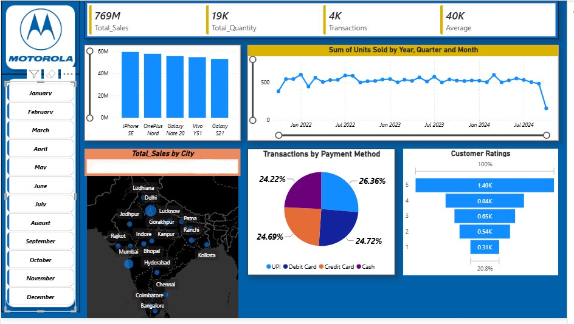

# Motorola Sales Analysis Dashboard

An interactive Power BI dashboard designed to analyze Motorola sales
performance, transactions, products, payment methods, customer ratings,
and geographical sales distribution.

## Dashboard Preview

 

## Project Overview

The Motorola Sales Analysis Dashboard is an interactive business
intelligence solution developed using Microsoft Power BI.

The dashboard provides a consolidated view of sales performance by
analyzing products, time periods, cities, payment methods, and
customer ratings.

Interactive filters allow users to explore the data across different
months and identify trends and patterns in sales performance.

## Key Metrics

- Total Sales: 769M
- Total Quantity: 19K
- Transactions: 4K
- Average Sales: 40K

  
## Dashboard Features

### 1. Sales Performance Analysis
- Total sales KPI
- Product-wise sales comparison
- Sales performance across different periods

### 2. Time-Series Analysis
- Units sold by year
- Quarterly sales analysis
- Monthly sales trends
- Interactive time-based analysis

### 3. Geographical Analysis
- City-wise sales distribution
- Geographical visualization of sales performance

### 4. Payment Method Analysis
- Transaction distribution by payment method
- Comparison of UPI, Debit Card, Credit Card, and Cash transactions

### 5. Customer Rating Analysis
- Distribution of customer ratings
- Analysis of transaction volume across rating categories

### 6. Interactive Filtering
- Month-wise filtering
- Interactive visual filtering
- Cross-filtering between dashboard visuals

  
## Technologies Used

- Microsoft Power BI
- Power Query
- DAX
- Data Modeling
- Data Visualization
- Microsoft Excel


## Data Preparation

Data preparation and transformation were performed using Power Query.

The data preparation process included:

- Importing the source dataset
- Cleaning the raw data
- Handling missing or inconsistent values
- Formatting columns appropriately
- Transforming data types
- Creating required columns
- Preparing the dataset for analysis

## DAX Measures

DAX was used to create calculated measures and KPIs for the dashboard.

Key measures included:

- Total Sales
- Total Quantity
- Total Transactions
- Average Sales 
- Sales-related aggregation measures

## Key Insights

The dashboard enables analysis of:

- Overall sales and transaction performance
- Differences in sales across products
- Monthly and yearly sales trends
- Geographical variations in sales
- Customer payment preferences
- Distribution of customer ratings
- Changes in sales volume across different time periods


## Project Structure

```text
PowerBI-Motorola-Sales-Dashboard/
│
├── Motorola_Sales_Dashboard.pbix
├── screenshots/
│   └── dashboard.jpg
└── README.md
```
## Skills Demonstrated

- Data Analysis
- Business Intelligence
- Data Visualization
- Power BI
- Power Query
- DAX
- Data Cleaning
- KPI Development
- Interactive Dashboard Development
- Time-Series Analysis
- Geographical Analysis
